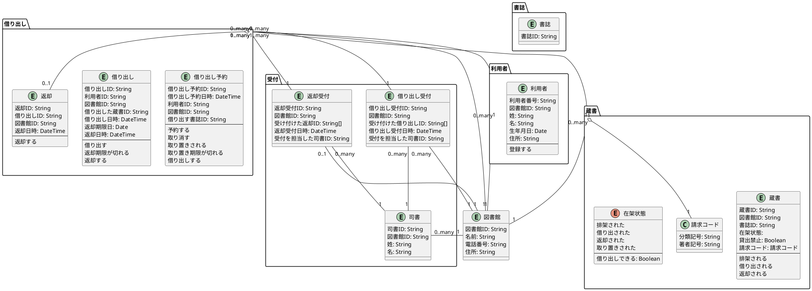
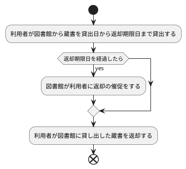
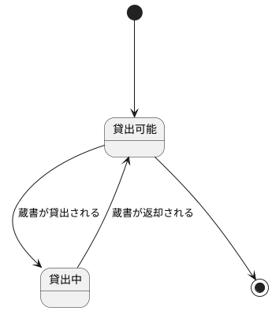
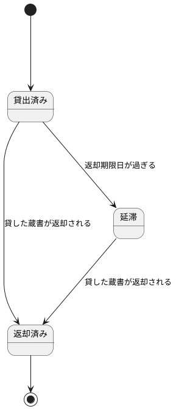

# 貸し出し管理

## ユースケース

| 名前 | 説明 |
| :--- | :--- |
| 利用者登録 | 来館者の姓、名、電話番号、生年月日、住所を登録し、利用者カードを発行する。 |
| 借り出し受付 | 受付に来た利用者を利用者一覧と照会し、貸出記録に利用者番号、蔵書番号、借り出し日時、返却期限日を記録する。蔵書に貸出日を記録する。 |
| 返却 | 司書が利用者に貸した蔵書の返却を受理する。 |

## 用語

| 和語 | 英語 | 意味 |
| :--- | :--- | :--- |
| 来館者 | Visitor | 図書館を利用する人のこと。利用カードを発行してもらっていない来館者が図書館内でできることには一定の制限がある。例えば蔵書を借りるには利用者カードを発行している必要がある。具体的な制限については図書館によって違う部分と共通する部分がある。 |
| 利用者 | User | 図書館で利用者登録をした人のこと。蔵書を借りたり返したりできる。 |
| 図書館 | Library | 蔵書をもつ施設。誰でも入館できる図書館とそうではない図書館がある。 |
| 司書 | Librarian | 図書館の現場で働くスタッフ。受付で蔵書を貸したり、返却の受付をしたりする。1日に1回納品された蔵書や返却された蔵書を排架する。月に1回選書と蔵書点検を行う。 |
| 蔵書 | Bibliotheca | 図書館が所蔵する図書。司書が書架（開架）に配架することで利用者が借りられる状態になる。 |
| 排架 | Shelving | 蔵書を指定された並び順で書架に置くこと。図書館によって決められた排架ルールがある。図書は分類番号によって並べることが多い。図書ではない資料は資料の種類ごとに並べることが多い。|
| 借り出し | Borrowing | 図書館にある蔵書を利用者が館外に一定期間に持ち出して読むこと。借り出しできる期間は予め決まっているが、休館日の兼ね合いで長くなることもある。借り出した蔵書は返却期限日までに図書館に返却する必要がある。 |
| 返却 | Returning | 利用者が借り出した蔵書を図書館に返却すること。 |
| 延滞 | Over Due | 図書館から借り出した蔵書を返却期限日が過ぎても返却していないこと。 |
| 借り出し中 | Borrowed | |

[comment]: <> (| 書架 | | 図書館で蔵書が置いてある棚。書架には開架と閉架がある。開架にある蔵書は利用者が閲覧したり借りたりすることができる。閉架にある蔵書は利用者が勝手に持ち出すことができない。閉架にある蔵書は司書に頼んで館内で閲覧させてもらう。 | )

## ワークフロー

## 状態遷移

